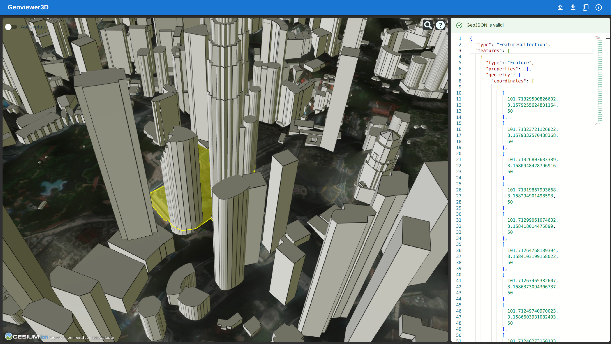

# Geoviewer3D
A simple 3D Viewer for GeoJSON files. This viewer supports 3D coordinates and allows the user to see their features on an earth model. Currently has default Bing basemap imagery, and uses OpenStreetMap 3d Buildings. This is a work in progress.

## Live app

There is a live working demo hosted on github pages: https://nishynair.github.io/Geoviewer3D/

## Usage
This code uses vite to run a ReactJS web app that has a viewer and code editor. For the viewer, it uses CesiumJS to render a 3D earth model with buildings and visualize GeoJSON data. For the editor it uses Monaco editor to display a GeoJSON file in an editor. To start, create a `.env` file to save your npm token:

    token="<Insert Cesium Ion Access Token>"
	  echo "VITE_CESIUM_TOKEN=$token" > .env

Then, install dependencies and run it:

    npm install
    npm run dev

There is a sample GeoJSON file stored in `./src/assets/` and this is used as the default GeoJSON in the viewer / editor. 

## License
GPLv3. Availabe in [LICENSE](./LICENSE).